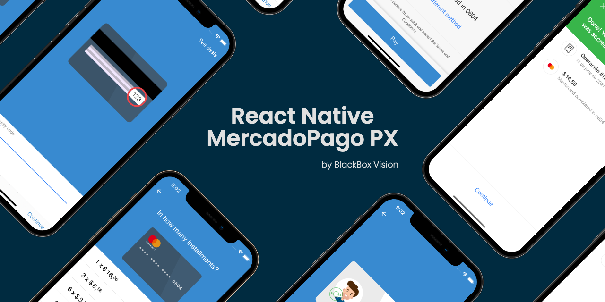

 
 

React Native Unofficial SDK for integrating MercadoPago PX Native UIs.

## Getting Started

To integrate this SDK you can check out our [docs](https://blackboxvision.github.io/react-native-mercadopago-px/docs/intro).

## Add your App 

We showcase the apps using currently our SDK. If you want to add your application, you need to perform a set of steps: 

1. Fork our repo and edit the following [JSON](https://github.com/BlackBoxVision/react-native-mercadopago-px/blob/master/docs/static/appsList.json).
2. Upload your images to `docs/static/img`.
3. Perform a PR.

## Enterprise Support 

We offer enterprise support for the following cases: 

- Make adjustments in the library or improve it to support a non-existent case.
- Help you perform an E2E integration in mobile, web and server-side.

In any case, you can <a href="mailto:hello@blackbox-vision.tech?subject=Enterprise Support - React Native MercadoPago PX">contact us</a> and we'll try to help you offering our experience. 

## Issues

Please, open an [issue](https://github.com/BlackBoxVision/react-native-mercadopago-px/issues) following one of the issues templates. We will do our best to fix them.

## Contributing

If you want to contribute to this project see [contributing](https://github.com/BlackBoxVision/react-native-mercadopago-px/blob/master/CONTRIBUTING.md) for more information.

## License

Distributed under the **MIT license**. See [LICENSE](https://github.com/BlackBoxVision/react-native-mercadopago-px/blob/master/LICENSE) for more information.
